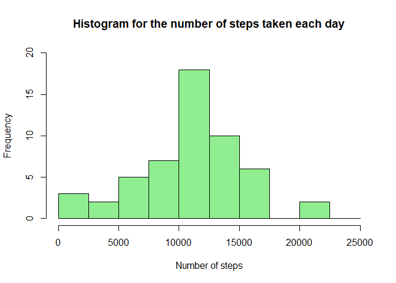
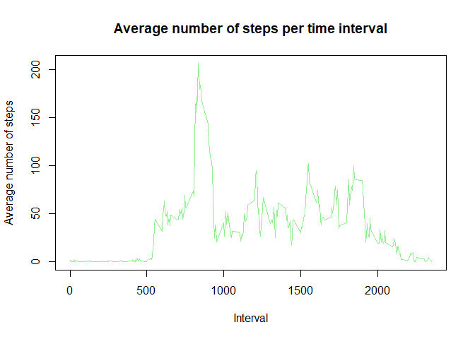
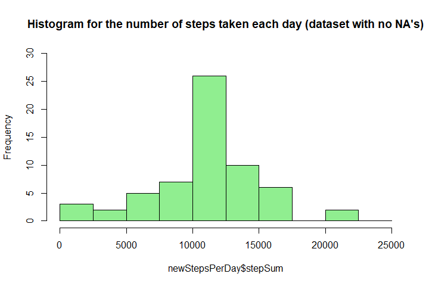
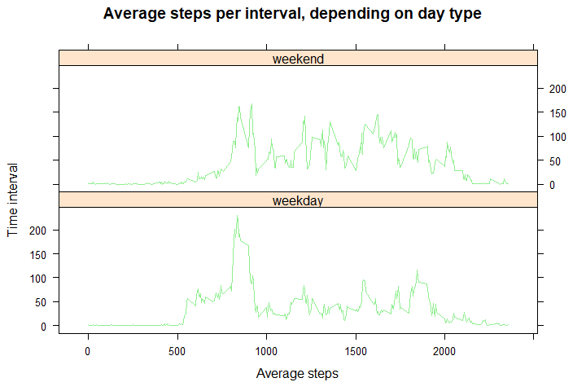

By: Diego Alejandro Suárez Rodríguez

## 1. Loading and preprocessing the data
Before beginning, the global options are configured:

```r
knitr::opts_chunk$set(warning=FALSE,message = FALSE)
```

First, it is needed to unzip the data from the `activity.zip` file

```r
unzip("activity.zip")
```

After this, the `.csv` file is loaded into the environment and converted in a dataset useful for the analysis
using the `read.table` function.

```r
data<-read.table("activity.csv",header = TRUE, sep = ",")
```

To allow a better undertanding of the dataset, the columns are reorganized in the following order: `date-interval-steps`

```r
steps<-data[1]
data[1]<-data[2]
data[2]<-data[3]
data[3]<-steps
colnames(data)<-c("date","interval","steps")
```
Then, the date column is converted into date format:

```r
data$date<-as.Date(data$date)
```
Finally, the first rows of the dataset are presented to the reader:

```r
head(data)
```

```
##         date interval steps
## 1 2012-10-01        0    NA
## 2 2012-10-01        5    NA
## 3 2012-10-01       10    NA
## 4 2012-10-01       15    NA
## 5 2012-10-01       20    NA
## 6 2012-10-01       25    NA
```
As well as a small summary of the data it contains

```r
summary(data)
```

```
##       date               interval          steps       
##  Min.   :2012-10-01   Min.   :   0.0   Min.   :  0.00  
##  1st Qu.:2012-10-16   1st Qu.: 588.8   1st Qu.:  0.00  
##  Median :2012-10-31   Median :1177.5   Median :  0.00  
##  Mean   :2012-10-31   Mean   :1177.5   Mean   : 37.38  
##  3rd Qu.:2012-11-15   3rd Qu.:1766.2   3rd Qu.: 12.00  
##  Max.   :2012-11-30   Max.   :2355.0   Max.   :806.00  
##                                        NA's   :2304
```

## 2. What is mean total number of steps taken per day?
On the first place, the data is grouped by days and then summarized using the `Dplyr` package

```r
library(dplyr)
stepsPerDay<-data %>% group_by(date)%>%summarise(stepSum = sum(steps))
head(stepsPerDay)
```

```
## # A tibble: 6 x 2
##   date       stepSum
##   <date>       <int>
## 1 2012-10-01      NA
## 2 2012-10-02     126
## 3 2012-10-03   11352
## 4 2012-10-04   12116
## 5 2012-10-05   13294
## 6 2012-10-06   15420
```

Then, the histogram for the number of steps taken each day is plotted  

```r
hist(stepsPerDay$stepSum,breaks = seq(0,25000, by=2500), ylim = c(0,20),col="lightgreen", main = "Histogram for the number of steps taken each day",xlab = "Number of steps")
```



From the histogram it can be concluded that the majority of the days the person walks between 10.000 and 12.500 steps. This visual guessing is proved calculating both the mean and he median of the total steps taken each day by the person.

```r
mean(stepsPerDay$stepSum, na.rm = TRUE)
```

```
## [1] 10766.19
```

```r
median(stepsPerDay$stepSum, na.rm = TRUE)
```

```
## [1] 10765
```

## 3. What is the average daily activity pattern?
The procedure followed is similar to the one developed for the calculation of the total number of steps per day, but now the dataframe is grouped by time interval. The opperation used is the mean function, taking into account that the na values have to be stripped before the calculation. Afterwards, the line plot is built

```r
stepsPerInterval<-data %>% group_by(interval)%>%summarise(stepMean = mean(steps,na.rm = TRUE))
plot(y = stepsPerInterval$stepMean,x = stepsPerInterval$interval,type = "l",main = "Average number of steps per time interval",xlab = "Interval",ylab = "Average number of steps",col="lightgreen")
```



Then, implementing the `which` function from R, it is calculated the 5 minute interval where the person walks the most

```r
pos<-which(stepsPerInterval$stepMean == max(stepsPerInterval$stepMean))
interval<-stepsPerInterval$interval[pos]
interval
```

```
## [1] 835
```

This calculation allows us to affirm that the 5 minute interval in which the person walks the most is the interval 835.

## 4. Imputing missing values
First, we calculate the total number of missing values

```r
sum(is.na(data$steps))
```

```
## [1] 2304
```

Then, the strategy that will be implemented to imput the missing values will be to replace the `NA` values with the mean for the given time interval. On the first place, a copy of the original dataset in created. On this dataset, the imputing procedure will be executed. On the second place, a loop that checks for the `NA` values in every row of the steps column is implemented. 

```r
newData <- data
for(i in 1:nrow(newData)){
  if(is.na(newData$steps[i])==TRUE){
    pos<-which(stepsPerInterval$interval==newData$interval[i])
    newData$steps[i]<-stepsPerInterval$stepMean[pos]
  }
}
```
After running this code, it can be seen that now there are not `NA` values on the dataset, mening the result obtained from the imputing procedure was satisfactory

```r
sum(is.na(newData$steps))
```

```
## [1] 0
```

Now, the histogram for the total number of steps taken each day based on the dataset with no `NA` values is built

```r
newStepsPerDay <- newData %>% group_by(date) %>% summarise(stepSum = sum(steps))
hist(newStepsPerDay$stepSum,breaks = seq(0,25000, by=2500), ylim = c(0,30),col="lightgreen", main = "Histogram for the number of steps taken each day (dataset with no NA's)")
```



Afterwards, the mean and the median for the total number of steps taken er day is calculated

```r
mean(newStepsPerDay$stepSum)
```

```
## [1] 10766.19
```

```r
median(newStepsPerDay$stepSum)
```

```
## [1] 10766.19
```
In conclusion, the results obtained before and after the data imputation were almost the same. Both the mean and the median value remained unchanged. Aditionally, the shape of the histogram remained the same. However, what the data imputation did was to increase the frequency in some of the values presented on the histogram, as there are more non `NA` values on the dataset.

## Are there differences in activity patterns between weekdays and weekends?
To begin, the new factor variable is calculated for each row by using the `ifelse` R function. After binding the new column to the dataset, it gets to have the following appearance

```r
dayType<-ifelse(weekdays(newData$date)=="sábado" | weekdays(newData$date)=="domingo","weekend","weekday")
newData<-cbind(newData,dayType)
head(newData)
```

```
##         date interval     steps dayType
## 1 2012-10-01        0 1.7169811 weekday
## 2 2012-10-01        5 0.3396226 weekday
## 3 2012-10-01       10 0.1320755 weekday
## 4 2012-10-01       15 0.1509434 weekday
## 5 2012-10-01       20 0.0754717 weekday
## 6 2012-10-01       25 2.0943396 weekday
```
Using the `table` function it can be seen that there were 4608 measurements taken on weekends and 12960 measurements taken on weekdays.

```r
table(newData$dayType)
```

```
## 
## weekday weekend 
##   12960    4608
```
Then, the newly added column is transformed into a factor variable. By using the `str` R function we can argue that the dataset is propperly built

```r
newData$dayType<-as.factor(newData$dayType)
str(newData)
```

```
## 'data.frame':	17568 obs. of  4 variables:
##  $ date    : Date, format: "2012-10-01" "2012-10-01" ...
##  $ interval: int  0 5 10 15 20 25 30 35 40 45 ...
##  $ steps   : num  1.717 0.3396 0.1321 0.1509 0.0755 ...
##  $ dayType : Factor w/ 2 levels "weekday","weekend": 1 1 1 1 1 1 1 1 1 1 ...
```
Now, using the `Dplyr`library, the dataset is grouped by both the `dayType` and the `interval` variables

```r
avgStepsPerIntervalDayType <- newData %>% group_by(dayType,interval) %>% summarise(averageSteps = mean(steps))
head(avgStepsPerIntervalDayType)
```

```
## # A tibble: 6 x 3
## # Groups:   dayType [1]
##   dayType interval averageSteps
##   <fct>      <int>        <dbl>
## 1 weekday        0       2.25  
## 2 weekday        5       0.445 
## 3 weekday       10       0.173 
## 4 weekday       15       0.198 
## 5 weekday       20       0.0990
## 6 weekday       25       1.59
```
At last, the required scatterplot is built by using the `lattice` library

```r
library(lattice)
newDF<-data.frame(avgStepsPerIntervalDayType)
xyplot(averageSteps~interval|dayType,data=newDF,layout=c(1,2),xlab="Average steps",ylab="Time interval",main="Average steps per interval, depending on day type",type="l", col="lightgreen")
```


All in all, it can be observed that on weekdays the walking activity of the person is highly concentrated between the intervals 500 to 1000. Meanwhile on weekends, the person tends to walk in a more uniform tendency from the time interval 700 up to the interval 2000.
